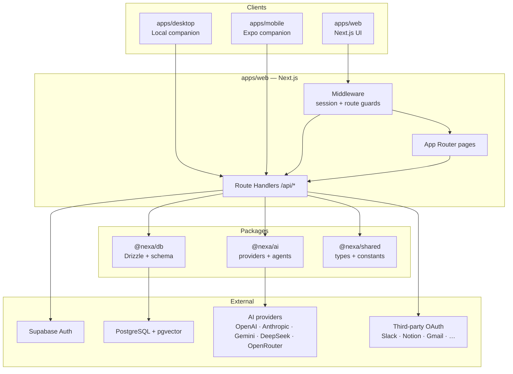
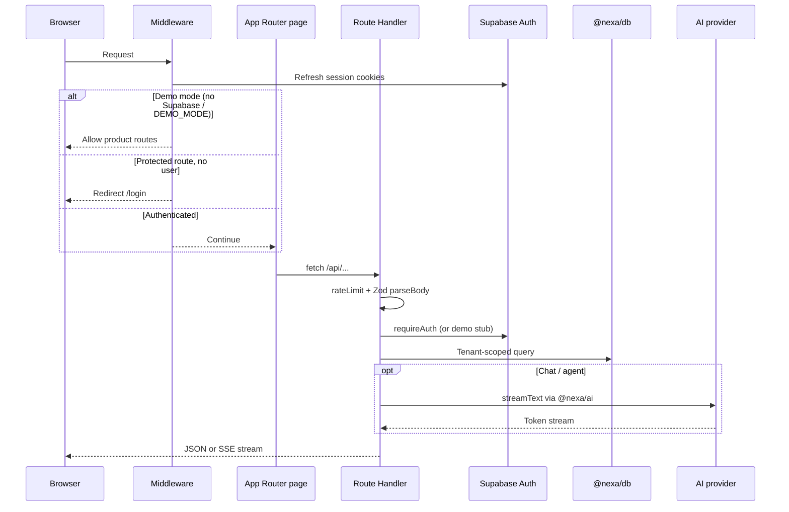
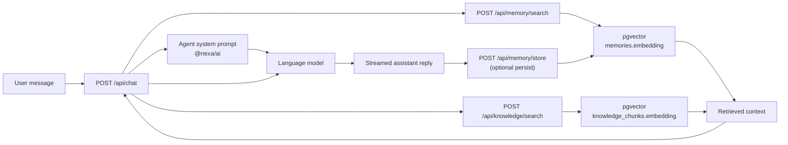
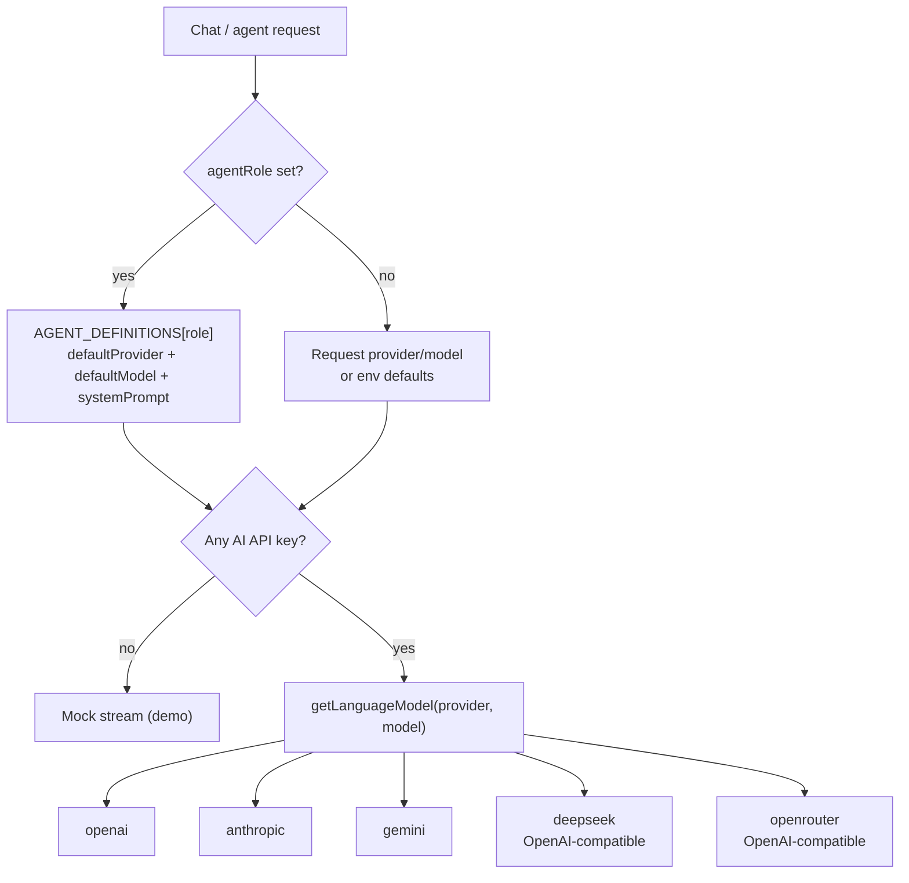
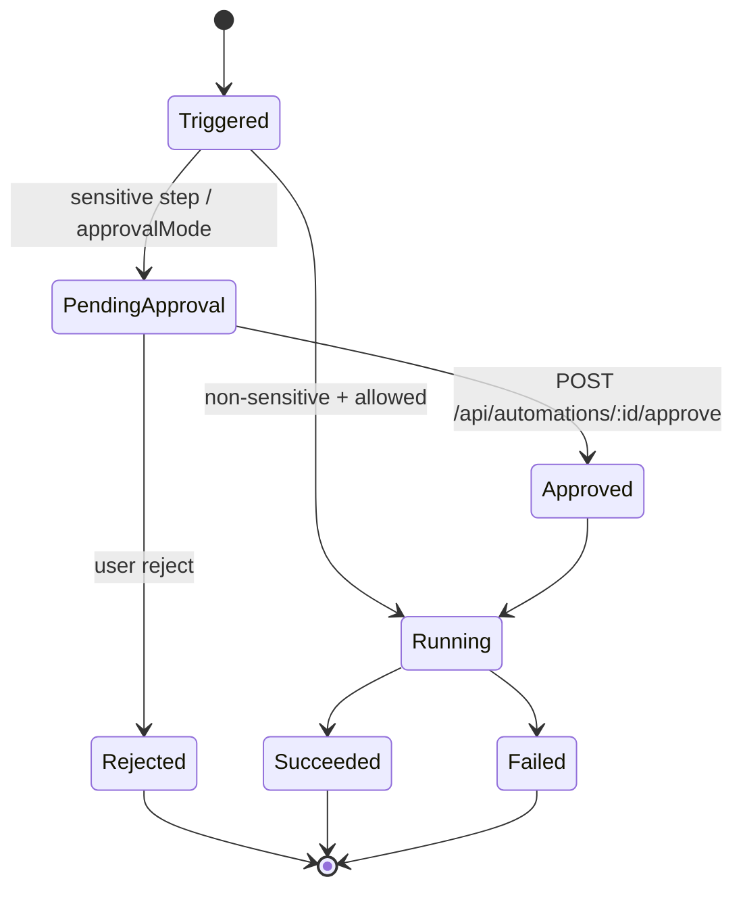

# Architecture

NEXA is a pnpm monorepo. The **web app** hosts the product UI and API. Shared domain logic lives in `packages/*`. Desktop and mobile companions bridge local devices under explicit permission constraints.

NEXA targets the **TWEEN** vision of an extensible AI operating system; the current architecture is the secure foundation for that composition model.

## System overview



## Package responsibilities

| Package | Responsibility |
|---------|----------------|
| `@nexa/web` | UI shells, middleware, Route Handlers, validation, encryption helpers, RBAC, audit, rate limits, demo store |
| `@nexa/ai` | `getLanguageModel()`, default models, `AGENT_DEFINITIONS` / guardrails |
| `@nexa/db` | Drizzle schema (profiles, workspaces, chat, memory, knowledge, tasks, integrations, automations, devices, audit), `createDb()` |
| `@nexa/shared` | `UserRole`, `AiProvider`, `AgentRole`, integration catalogs, `SENSITIVE_AUTOMATION_ACTIONS`, shared error types |

Workspace wiring: `pnpm-workspace.yaml` → `apps/*`, `packages/*`. Orchestration: Turborepo (`turbo.json`).

## Request path (authenticated)



## Data flow: chat + memory + knowledge



Embeddings use **1536 dimensions** (OpenAI-compatible default). When `DATABASE_URL` is unset, memory routes fall back to the in-process demo store (no vectors).

## AI provider resolution



Defaults live in `packages/ai/src/providers/index.ts` (`DEFAULT_MODELS`) and `.env.example` (`DEFAULT_AI_PROVIDER`, `DEFAULT_AI_MODEL`).

## Tenancy model

All product tables are scoped by `userId` and/or `workspaceId`:

- **Profile** ↔ Supabase user (`supabaseUserId`)
- **Workspace** owned by a profile; members carry a `user_role`
- Conversations, agents, knowledge, tasks, notes, calendar, integrations, and automations belong to a workspace
- **Devices** belong to a user; desktop devices carry `approvedPaths`
- **Audit logs** record workspace/user, action, resource, IP, user agent

RBAC enforcement: `apps/web/src/lib/rbac.ts` (`Permission` matrix by role).

## Automation approval flow



Sensitive action catalog (`@nexa/shared`): `send_message`, `publish_content`, `modify_data`, `delete_data`, `charge_payment`, `send_email`.

## Demo vs production paths

| Concern | Demo | Production |
|---------|------|------------|
| Auth | Open routes; optional `x-nexa-demo-user` / stub bearer | Supabase session cookies |
| Persistence | `demo-store` (memory) | Postgres via `@nexa/db` |
| Chat | Mock stream without API keys | Live `streamText` |
| Integrations | OAuth URL stubs | Real provider authorize + encrypted tokens |
| Rate limit | In-memory Map | Replace with Redis for multi-instance |

## Directory map (web)

```
apps/web/src/
├── app/
│   ├── (auth)/          # login, signup
│   ├── (app)/           # authenticated product modules
│   ├── api/             # Route Handlers
│   ├── layout.tsx
│   └── page.tsx         # marketing / entry
├── components/          # layout, chat, dashboard, UI primitives
├── config/navigation.ts
├── lib/                 # api, rbac, encryption, audit, env, supabase, validators
└── middleware.ts
```

## Related docs

- [SECURITY.md](./SECURITY.md) — hardening model
- [DATABASE.md](./DATABASE.md) — schema and migrations
- [MODULES.md](./MODULES.md) — routes and APIs per module
- [DEPLOYMENT.md](./DEPLOYMENT.md) — hosting topology
