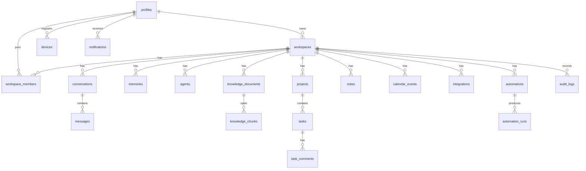

# Database

NEXA persists product data in **PostgreSQL** with **pgvector** for semantic memory and knowledge retrieval. The schema and migrations are owned by `@nexa/db` (Drizzle ORM).

## Overview

| Item | Value |
|------|-------|
| Package | `packages/db` (`@nexa/db`) |
| ORM | Drizzle ORM + `postgres` (postgres.js) |
| Config | `packages/db/drizzle.config.ts` |
| Schema | `packages/db/src/schema/index.ts` |
| Client | `createDb()` in `packages/db/src/index.ts` |
| Connection | `DATABASE_URL` |
| Vector dimensions | **1536** (`memories.embedding`, `knowledge_chunks.embedding`) |

Enable pgvector before migrating:

```sql
CREATE EXTENSION IF NOT EXISTS vector;
```

(Supabase: Database → Extensions → `vector`.)

## Entity relationship (summary)



## Schema overview

### Identity & tenancy

| Table | Purpose |
|-------|---------|
| `profiles` | App user linked to `supabase_user_id`; preferences, MFA flag |
| `workspaces` | Tenant boundary; owner, slug, settings |
| `workspace_members` | Membership + `user_role` (`owner` \| `admin` \| `member` \| `viewer`) |

### Chat & agents

| Table | Purpose |
|-------|---------|
| `conversations` | Thread metadata: provider, model, optional `agent_id` |
| `messages` | Roles `system` \| `user` \| `assistant` \| `tool`; attachments JSON |
| `agents` | AI employees: role, system prompt, tools, permissions, model |

### Memory & knowledge (pgvector)

| Table | Purpose |
|-------|---------|
| `memories` | Long-term memory rows + `embedding vector(1536)`, importance, expiry |
| `knowledge_documents` | Uploaded docs: storage path, mime, indexing status |
| `knowledge_chunks` | Chunk text + `embedding vector(1536)` for RAG |

Statuses for documents: `pending` → `processing` → `indexed` \| `failed`.

### Work modules

| Table | Purpose |
|-------|---------|
| `projects` | Task grouping |
| `tasks` | Status, priority, assignee, checklist, AI summary |
| `task_comments` | Discussion on tasks |
| `note_folders` / `notes` | Hierarchical notes; rich content JSON + `plain_text` |
| `calendar_events` | Local + synced events (`external_id` / `external_provider`) |

### Integrations & automations

| Table | Purpose |
|-------|---------|
| `integrations` | Provider connection; **`encrypted_credentials`** only — never plaintext secrets |
| `automations` | Trigger + steps JSON; `approval_mode` |
| `automation_runs` | Run lifecycle including `pending_approval` → `approved` / `rejected` |

Integration statuses: `connected` \| `disconnected` \| `error` \| `pending`.

### Devices, notifications, audit

| Table | Purpose |
|-------|---------|
| `devices` | web / desktop / ios / android; `approved_paths`, permissions, push token |
| `notifications` | In-app notifications |
| `audit_logs` | Action, resource, IP, UA, metadata |

## Enums

Defined in schema:

- `user_role`, `task_status`, `task_priority`
- `integration_status`, `automation_run_status`, `document_status`, `device_type`

## Migrations with Drizzle

From the repo root (with `DATABASE_URL` set):

```bash
# After editing packages/db/src/schema/index.ts
pnpm db:generate   # drizzle-kit generate → packages/db/drizzle/

pnpm db:migrate    # drizzle-kit migrate

pnpm db:studio     # optional GUI
```

Equivalent package scripts:

```bash
pnpm --filter @nexa/db generate
pnpm --filter @nexa/db migrate
pnpm --filter @nexa/db studio
```

### Workflow checklist

1. Enable `vector` extension on the target database.
2. Set `DATABASE_URL` in `.env.local` / CI secrets.
3. Change schema in `packages/db/src/schema/index.ts`.
4. Run `pnpm db:generate` and review SQL under `packages/db/drizzle/`.
5. Apply with `pnpm db:migrate` against staging, then production.
6. Keep schema and application reads/writes tenant-scoped (`workspaceId` / `userId`).

### Client usage

```ts
import { createDb } from "@nexa/db";

const db = createDb(); // reads process.env.DATABASE_URL
```

`createDb` uses a singleton postgres.js client (`max: 10`, `prepare: false` — suitable for serverless-friendly Postgres / Supabase).

## Demo mode without a database

When `DATABASE_URL` is unset, web APIs that need persistence use `apps/web/src/lib/demo-store.ts` (ephemeral, process-local). Vector search is stubbed; connect Postgres + pgvector for durable memory/RAG.

## Indexing notes

The schema defines B-tree indexes on foreign keys and common filters (workspace, user, conversation, document). For production vector search, add an approximate index after data volume warrants it, e.g.:

```sql
CREATE INDEX memories_embedding_idx
  ON memories USING hnsw (embedding vector_cosine_ops);

CREATE INDEX knowledge_chunks_embedding_idx
  ON knowledge_chunks USING hnsw (embedding vector_cosine_ops);
```

(Exact index type/ops may vary by Postgres/pgvector version — validate in your environment.)

## Security notes for data

- `integrations.encrypted_credentials` must always store ciphertext from AES-256-GCM (`ENCRYPTION_KEY`).
- Never store third-party passwords in any table.
- `audit_logs` retain operational history; treat as sensitive and access via RBAC (`audit.read`).
- Prefer soft boundaries: cascade deletes are defined for workspace teardown — use deliberately.

## Related docs

- [ARCHITECTURE.md](./ARCHITECTURE.md) — data flow and tenancy
- [SECURITY.md](./SECURITY.md) — encryption and audit
- [DEPLOYMENT.md](./DEPLOYMENT.md) — env vars for hosted Postgres
