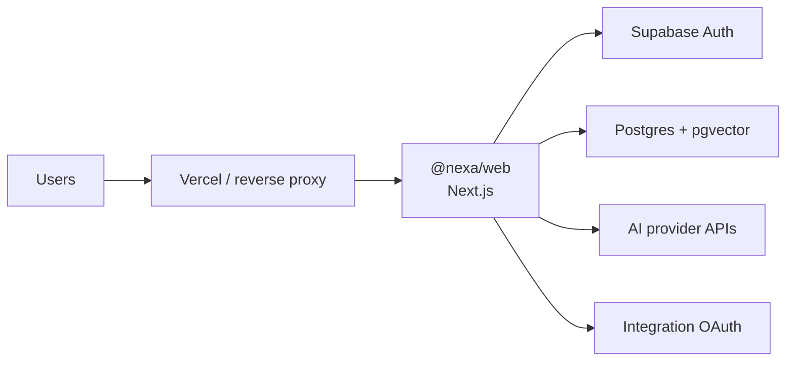

# Deployment

Deploy NEXA web on **Vercel** for managed hosting, or **Docker** for self-hosted stacks with Postgres (pgvector).

## Architecture (production)



## Vercel

1. Import the monorepo into Vercel.
2. Set the app to build `@nexa/web`:
   - **Install:** `pnpm install`
   - **Build:** `pnpm build:web` (or `pnpm --filter @nexa/web build`)
   - **Output:** Next.js defaults for `apps/web` — set **Root Directory** to `apps/web` *or* keep monorepo root and configure the filter above consistently with Vercel’s pnpm support.
3. Attach environment variables (below). Never commit `.env.local`.
4. Run DB migrations against production `DATABASE_URL` from CI or a one-off secure job (`pnpm db:migrate`) **before** relying on new schema.
5. Enable pgvector on the production database.
6. Confirm `NEXT_PUBLIC_APP_URL` matches the deployment URL (Auth redirects, OAuth callbacks, WebAuthn origin).

Recommended:

- Preview vs Production env separation
- Rotate `ENCRYPTION_KEY` only with a re-encryption plan for existing `encrypted_credentials`
- Disable all demo stubs: do not set `DEMO_MODE=true`, `NEXA_AUTH_STUB=1`

## Docker

Assets live under `/workspace/docker`. Typical self-host layout:

| Service | Role |
|---------|------|
| `web` | Next.js standalone or `next start` for `@nexa/web` |
| `db` | Postgres 16+ with `vector` extension |
| optional `redis` | Shared rate-limit / session cache |

Example flow:

```bash
# Build web image from monorepo context (Dockerfile under docker/)
docker build -f docker/Dockerfile -t nexa-web .

# Run with secrets injected (do not bake .env into the image)
docker run --env-file .env.production -p 3000:3000 nexa-web
```

Compose should:

1. Start Postgres, run `CREATE EXTENSION vector`, apply migrations.
2. Start web with `DATABASE_URL` pointing at the DB service.
3. Mount no secrets into the image layers; use runtime env or a secret manager.

Health probe: `GET /api/health`.

## Environment variables

Source of truth: `.env.example`.

### App

| Variable | Required | Notes |
|----------|----------|-------|
| `NEXT_PUBLIC_APP_URL` | yes (prod) | Canonical origin |
| `NEXT_PUBLIC_APP_NAME` | no | Defaults conceptually to NEXA |
| `DEMO_MODE` | no | Force demo UI; **off** in production |
| `NEXA_AUTH_STUB` | no | Auth bypass stub; **never** in production |
| `LOG_LEVEL` | no | `debug` \| `info` \| `warn` \| `error` |

### Supabase

| Variable | Required | Notes |
|----------|----------|-------|
| `NEXT_PUBLIC_SUPABASE_URL` | yes (prod) | Project URL |
| `NEXT_PUBLIC_SUPABASE_ANON_KEY` | yes (prod) | Public anon key |
| `SUPABASE_SERVICE_ROLE_KEY` | yes (server) | Server only |

### Database

| Variable | Required | Notes |
|----------|----------|-------|
| `DATABASE_URL` | yes (prod) | Postgres connection string |

### Auth OAuth (optional providers)

| Variable | Notes |
|----------|-------|
| `GOOGLE_CLIENT_ID` / `GOOGLE_CLIENT_SECRET` | Supabase + server flows |
| `GITHUB_CLIENT_ID` / `GITHUB_CLIENT_SECRET` | |
| `APPLE_CLIENT_ID` / `APPLE_CLIENT_SECRET` | |

### AI

| Variable | Notes |
|----------|-------|
| `OPENAI_API_KEY` | |
| `ANTHROPIC_API_KEY` | |
| `GOOGLE_AI_API_KEY` | Gemini |
| `DEEPSEEK_API_KEY` | |
| `OPENROUTER_API_KEY` | |
| `DEFAULT_AI_PROVIDER` | e.g. `openai` |
| `DEFAULT_AI_MODEL` | e.g. `gpt-4o` |

At least one provider key is required for live chat; otherwise the API mock-streams.

### Security & limits

| Variable | Required | Notes |
|----------|----------|-------|
| `ENCRYPTION_KEY` | yes (prod w/ integrations) | 64 hex chars — `openssl rand -hex 32` |
| `RATE_LIMIT_REQUESTS_PER_MINUTE` | no | Default `60` |

### WebAuthn

| Variable | Notes |
|----------|-------|
| `WEBAUTHN_RP_ID` | e.g. `app.example.com` |
| `WEBAUTHN_RP_NAME` | e.g. `NEXA` |
| `WEBAUTHN_ORIGIN` | Must match app origin |

### Integration OAuth (optional)

`SLACK_*`, `NOTION_*`, `STRIPE_*`, `DISCORD_*`, etc. — see `.env.example`.

### Desktop

| Variable | Notes |
|----------|-------|
| `DESKTOP_ALLOWED_PATHS` | Extra server-side constraint list for companions |

## Migration checklist (release)

1. Enable `vector` on target DB.
2. Set/rotate env secrets in the host (Vercel / orchestrator).
3. `pnpm db:generate` (if schema changed) → review SQL → `pnpm db:migrate`.
4. Deploy web build.
5. Smoke: `/api/health`, login, chat with a real provider key, OAuth connect (no passwords), automation approve path.
6. Verify audit logs and rate-limit headers/behavior under load.

## Security deployment notes

- TLS everywhere; HSTS at the edge.
- Cookie sessions: SameSite Lax/Strict; no tokens in query strings.
- Restrict `SUPABASE_SERVICE_ROLE_KEY` and `ENCRYPTION_KEY` to server runtimes only.
- Callback URLs for every OAuth provider must allowlist the production origin.
- Path sandboxing for desktop companions remains mandatory in production builds.

## Related docs

- [ARCHITECTURE.md](./ARCHITECTURE.md)
- [SECURITY.md](./SECURITY.md)
- [DATABASE.md](./DATABASE.md)
- [DEVELOPMENT.md](./DEVELOPMENT.md)
